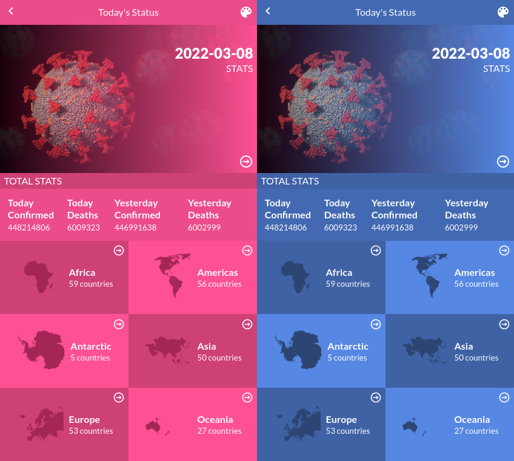

# Covid 19 Status.

web app for showing covid 19 status by country, built using ReactJS and redux.
the list of countries is from the [restcountries API](https://restcountries.com) and the covid data is from [Narrativa](https://covid19tracking.narrativa.com).

> only mobile version so far

## Live Link

In the following link, you can view the [web app](https://capstone-covid.netlify.app/).

## Built With

- ReactJS
- Redux

## Getting Started

start by cloning the repository.

`git clone https://github.com/rachidelaid/react-capstone-covid19.git`

cd to the folder.

`cd react-capstone-covid19`

install all the dependencies.

`npm install`

run the live server

`npm run start`

go to [http://localhost:3000](http://localhost:3000)

build the distribution folder before hosting the app

`npm run build`

after the build you can host the `build` folder.

## Authors

👤 **Rachid El aid**

- GitHub: [@rachidelaid](https://github.com/rachidelaid)
- Twitter: [@rachidelaid1](https://twitter.com/rachidelaid1)
- LinkedIn: [Rachid El aid](https://www.linkedin.com/in/rachid-elaid-106336203/)

## 🤝 Contributing

Contributions, issues, and feature requests are welcome!

Feel free to check the [issues page](../../issues/).

## Acknowledgments

I wanna thank [Ballhead](<https://www.behance.net/gallery/31579789/Ballhead-App-(Free-PSDs)>) from behance for the awsome design.

## Show your support

Give a ⭐️ if you like this project!

## 📝 License

This project is [MIT](./MIT.md) licensed.
